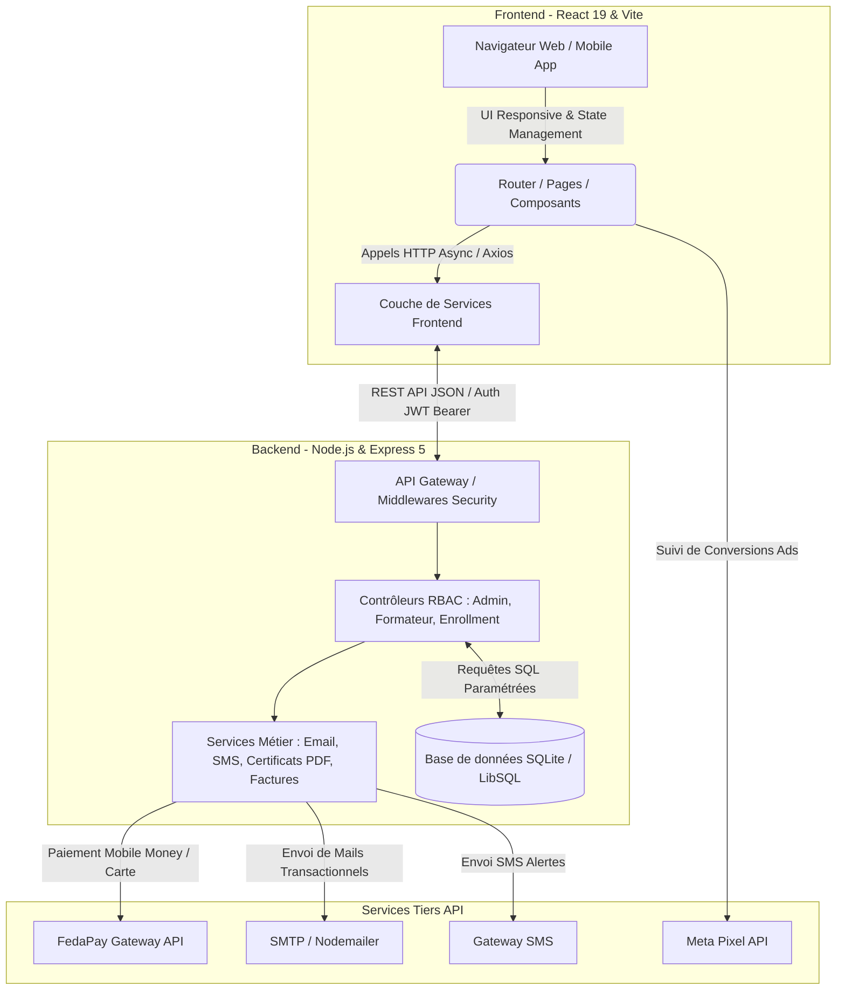
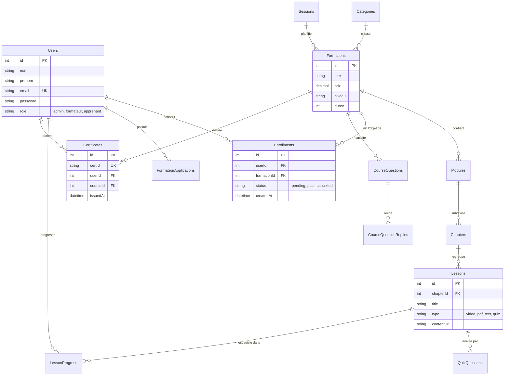

# RAPPORT DE STAGE

---

**UNIVERSITÉ / ÉCOLE / INSTITUT DE FORMATION**  
*[Insérez le nom de votre établissement d'enseignement]*  
*[Insérez votre département / filière — ex: Licence / Master en Génie Logiciel & Systèmes d'Information]*

---

### **SUJET DU STAGE :**
## **CONCEPTION ET DÉVELOPPEMENT D'UNE PLATEFORME D'APPRENTISSAGE EN LIGNE (LMS) ET DE GESTION PÉDAGOGIQUE MULTICANAL : PROJET « NOVATECH »**

---

**Présenté et soutenu par :**  
*[Votre Prénom et NOM]*  

**Période du stage :**  
Du *[Date de début, ex: 1er Mars 2026]* au *[Date de fin, ex: 30 Juin 2026]*  

**Lieu de déroulement :**  
*[Nom de l'entreprise ou Structure d'accueil — ex : NovaTech Academy / Tech Innovation]*  
*[Adresse de l'entreprise, Ville, Pays]*  

**Sous le tutorat / encadrement de :**  
- **Maître de stage (Entreprise) :** *[Nom du Maître de stage, Poste — ex : Directeur Technique / Lead Developer]*  
- **Tuteur pédagogique (École/Université) :** *[Nom du Tuteur, Titre — ex : Professeur / Docteur en Informatique]*  

---

**Année universitaire :** 2025 – 2026

---

## REMERCIEMENTS

Avant de développer les expériences et les conclusions d'analyse de ce stage, il me paraît indispensable de commencer ce rapport par des remerciements envers l'ensemble des personnes qui, de près ou de loin, ont contribué au bon déroulement de ce stage et à la réussite de ce projet.

J'exprime ma profonde gratitude envers ***[Nom de l'entreprise / structure d'accueil]***, et plus particulièrement à ***[Nom du Maître de stage]***, mon maître de stage, pour m'avoir accueilli au sein de l'équipe de développement, pour sa disponibilité, ses conseils techniques judicieux et la confiance qu'il m'a accordée tout au long de cette période d'intégration professionnelle. Sa rigueur et sa pédagogie ont été des moteurs essentiels dans mon apprentissage des architectures fullstack modernes.

Je tiens également à remercier l'ensemble de l'équipe technique et pédagogique pour leur accueil chaleureux, leur esprit de collaboration et les échanges enrichissants qui ont grandement facilité mon intégration au sein de l'environnement de travail.

Mes remerciements s'adressent de plus à ***[Nom du Tuteur pédagogique]***, mon tuteur universitaire, ainsi qu'à l'ensemble du corps professoral de ***[Nom de votre établissement]*** pour la qualité de la formation théorique et pratique dispensée, laquelle m'a fourni les bases conceptuelles et techniques indispensables à la réalisation de ce projet d'envergure.

Enfin, je remercie ma famille et mes proches pour leur soutien moral et leurs encouragements constants au cours de mes études et durant la rédaction de ce rapport.

---

## SOMMAIRE

1. **INTRODUCTION GÉNÉRALE**
2. **CHAPITRE 1 : PRÉSENTATION DU CONTEXTE ET ANALYSE DE L'EXISTANT**
   - 1.1 Présentation de la structure d'accueil et du projet NovaTech
   - 1.2 Problématique de l'e-learning et du paiement en ligne en Afrique
   - 1.3 Objectifs professionnels et pédagogiques du stage
3. **CHAPITRE 2 : CONCEPTION DU SYSTÈME ET ARCHITECTURE LOGICIELLE**
   - 2.1 Spécifications fonctionnelles et acteurs du système
   - 2.2 Architecture technique et modèle Client-Serveur
   - 2.3 Modélisation de la base de données (Schéma relationnel 21 tables)
   - 2.4 Conception UI/UX et Design System
4. **CHAPITRE 3 : CHOIX DES TECHNOLOGIES ET OUTILS DE DÉVELOPPEMENT**
   - 3.1 Stack Frontend : React 19, Vite, Tailwind & Vanilla CSS, Recharts
   - 3.2 Stack Backend : Node.js, Express.js 5, SQLite / LibSQL
   - 3.3 Services tiers et intégrations : FedaPay, PDFKit, Nodemailer, Meta Pixel
5. **CHAPITRE 4 : RÉALISATION ET FONCTIONNALITÉS DÉVELOPPÉES**
   - 4.1 Module Public et Catalogue de Formations
   - 4.2 Espace Apprenant et Lecteur Pédagogique Interactif
   - 4.3 Espace Formateur et Conception de Cours (Course Builder)
   - 4.4 Espace Administrateur, Pilotage Financier et Analytique
   - 4.5 Gestion de la Sécurité, Authentification JWT et RBAC
6. **CHAPITRE 5 : TESTS, DÉPLOIEMENT ET DIFFICULTÉS RENCONTRÉES**
   - 5.1 Stratégie de validation et tests fonctionnels
   - 5.2 Difficultés techniques surmontées et solutions apportées
   - 5.3 Déploiement continu et hébergement
7. **BILAN DU STAGE ET CONCLUSION GÉNÉRALE**
   - 7.1 Bilan des compétences techniques et professionnelles acquises
   - 7.2 Perspectives d'évolution de la plateforme
   - 7.3 Conclusion générale
8. **GLOSSAIRE ET SIGLES**

---

## INTRODUCTION GÉNÉRALE

La transformation digitale redéfinit en profondeur les modes de communication, d'organisation et, tout particulièrement, les mécanismes de transmission du savoir. Dans ce contexte, l'enseignement à distance et la formation professionnelle en ligne (E-learning) connaissent un essor spectaculaire. En Afrique, et plus spécifiquement en Afrique de l'Ouest, cette révolution fait face à des défis uniques et stimulants : la nécessité d'une infrastructure logicielle légère et performante, l'adaptation aux modes de paiement locaux (notamment le Mobile Money), ainsi que le besoin de délivrer des certifications vérifiables et reconnues sur le marché du travail.

C'est dans cette dynamique d'innovation que s'inscrit mon stage de fin d'études, effectué au sein de ***[Nom de l'entreprise]*** sur le projet **NovaTech**. NovaTech est conçu comme un écosystème d'apprentissage en ligne moderne (Learning Management System - LMS), orienté vers les métiers de la technologie et du numérique (développement web, intelligence artificielle, design, data science).

L'objectif principal de ce stage a été la conception et le développement complet de la plateforme fullstack NovaTech. Ce projet répond au besoin critique de fournir une interface interactive et fluide pour les apprenants, des outils de structuration de cours avancés pour les formateurs, et une interface d'administration puissante incluant le suivi financier, la gestion marketing et l'automatisation de la certification.

Le présent rapport détaille les différentes phases du projet, depuis l'analyse des besoins et la conception architecturale jusqu'à l'implémentation technique, l'intégration des services tiers (FedaPay, Meta Pixel, PDFKit) et le déploiement final, en mettant en lumière les compétences en ingénierie logicielle développées durant cette expérience professionnelle.

---

## CHAPITRE 1 : PRÉSENTATION DU CONTEXTE ET ANALYSE DE L'EXISTANT

### 1.1 Présentation de la structure d'accueil et du projet NovaTech
***[Nom de l'entreprise]*** est une structure innovante intervenant dans le secteur des technologies de l'information et de l'ingénierie logicielle. Elle a pour vocation d'accompagner la transition numérique des institutions et de démocratiser l'accès aux compétences technologiques de pointe. 

Le projet **NovaTech** (ou NovaTech Academy) est né d'un constat stratégique : les plateformes d'apprentissage internationales (comme Coursera ou Udemy) s'avèrent souvent inadaptées aux réalités économiques locales (problèmes de paiement par carte bancaire internationale, bande passante requise trop élevée, manque d'accompagnement personnalisé et absence d'intégration avec les canaux de marketing et de communication locaux). NovaTech ambitionne de combler ce vide en offrant une plateforme LMS sur mesure, ultra-réactive et intégrée à l'écosystème technologique ouest-africain.

### 1.2 Problématique de l'e-learning et du paiement en ligne en Afrique
La réalisation d'un LMS adapté au contexte local soulève plusieurs problématiques majeures :
1. **La fragmentation des paiements :** En Afrique de l'Ouest, la majorité des transactions financières s'effectue via des services de Mobile Money (MTN Mobile Money, Moov Money, Orange Money, Celtiis). Une plateforme e-learning efficace doit obligatoirement intégrer un agrégateur local sécurisé pour convertir instantanément un paiement en inscription validée.
2. **L'ergonomie et l'accessibilité :** Les apprenants se connectant souvent via des terminaux mobiles ou des connexions à débit variable, l'application doit être extrêmement légère, optimisée (Single Page Application avec mise en cache), et proposer une interface utilisateur intuitive (UI/UX moderne).
3. **L'intégrité et la valorisation des compétences :** Les certificats délivrés en fin de formation doivent posséder un mécanisme anti-fraude robuste permettant aux employeurs de vérifier leur authenticité en temps réel via un identifiant unique ou un code QR.
4. **L'acquisition et le suivi analytique :** Pour attirer de nouveaux apprenants, le centre de formation a besoin de suivre avec précision l'efficacité de ses campagnes publicitaires sur les réseaux sociaux (Facebook, Instagram) grâce à l'intégration d'outils de pistage côté serveur et côté client (Meta Pixel).

### 1.3 Objectifs professionnels et pédagogiques du stage
En tant qu'ingénieur logiciel en stage, ma mission s'est articulée autour de quatre objectifs primordiaux :
- **Architecturer le système** : Définir une architecture RESTful modulaire, découplant le backend (Node.js/Express) du frontend (React 19).
- **Développer le moteur pédagogique** : Implémenter un système hiérarchique de cours (Formations $\rightarrow$ Modules $\rightarrow$ Chapitres $\rightarrow$ Leçons vidéo/texte/PDF $\rightarrow$ Quiz d'évaluation) avec suivi de progression granulaire.
- **Intégrer les services tiers critiques** : Connecter l'API de paiement **FedaPay**, configurer le générateur PDF **PDFKit** pour la diplomation automatique, et implémenter le service de notification par email (**Nodemailer**) et SMS.
- **Sécuriser la plateforme** : Mettre en œuvre une politique de sécurité rigoureuse avec authentification JWT (JSON Web Tokens), contrôle d'accès basé sur les rôles (RBAC) et protection contre les vulnérabilités web standards (XSS, CSRF, injections SQL).

---

## CHAPITRE 2 : CONCEPTION DU SYSTÈME ET ARCHITECTURE LOGICIELLE

### 2.1 Spécifications fonctionnelles et acteurs du système
L'analyse des exigences a permis d'identifier quatre profils d'utilisateurs distincts interagissant avec l'application :

| Acteur / Profil | Rôle et Permissions principales dans le système |
| :--- | :--- |
| **Visiteur (Public)** | Consulte le catalogue des formations, filtre par catégorie/session, lit la FAQ, soumet des messages de contact et peut faire une demande de candidature pour devenir formateur. |
| **Apprenant (Student)** | S'inscrit et paie ses formations en ligne via FedaPay, suit ses cours interactifs, passe les quiz de validation, pose des questions dans le forum du cours, suit son pourcentage de progression et télécharge son certificat de réussite une fois la formation achevée. |
| **Formateur (Instructor)** | Dispose d'un tableau de bord pour créer et structurer ses formations (Course Builder), gère ses modules et chapitres, ajoute du contenu pédagogique (vidéos, quiz), consulte la liste de ses apprenants inscrits et répond aux questions techniques. |
| **Administrateur (Admin)** | Supervise l'ensemble de la plateforme : validation des comptes formateurs, CRUD global sur les cours, catégories et sessions, suivi en temps réel des inscriptions et des revenus (graphiques financiers), paramétrage du Meta Pixel et modification du contenu des pages statiques (CMS). |

---

### 2.2 Architecture technique et modèle Client-Serveur
Le projet adopte une architecture logicielle moderne en **Client-Serveur découplé**, communiquant exclusivement via des interfaces de programmation (API RESTful) au format JSON. Cette séparation garantit une évolutivité maximale, permettant à l'avenir de greffer facilement une application mobile native sans modifier le serveur backend.



---

### 2.3 Modélisation de la base de données (Schéma relationnel)
La base de données a été modélisée pour assurer la cohérence et l'intégrité référentielle d'un système d'apprentissage complexe. Le moteur relationnel **SQLite / LibSQL** a été sélectionné pour sa fiabilité atomique (ACID), sa rapidité d'exécution et sa facilité de sauvegarde intégrée. Le schéma comporte **21 tables relationnelles interconnectées**.



#### Synthèse des tables principales et de leur rôle :
1. **`Users`** : Stocke l'identité, les identifiants de connexion hachés (`bcryptjs`) et le rôle RBAC (`admin`, `formateur`, `apprenant`).
2. **`Formations`, `Categories`, `Sessions`** : Définissent le catalogue de cours, leur tarification, leur classification métier et les fenêtres temporelles de formation.
3. **`Modules`, `Chapters`, `Lessons`, `QuizQuestions`** : Constituent l'arborescence pédagogique granulaire de chaque cours.
4. **`Enrollments`** : Gère les inscriptions, en liant un apprenant à une formation et en traçant le statut de la transaction financière (initiation, paiement validé via FedaPay).
5. **`LessonProgress`** : Table de liaison avec contrainte d'unicité `(userId, lessonId)` calculant le taux de complétion exact d'un étudiant pour débloquer la diplomation.
6. **`Certificates` & `Invoices`** : Enregistrent les documents légaux et académiques générés automatiquement par le système, avec des clés de vérification uniques (`certId`).
7. **`CourseQuestions` & `CourseQuestionReplies`** : Structurent le forum d'entraide pédagogique intégré à chaque formation.
8. **`Formateurs` & `FormateurApplications`** : Gèrent la validation et l'affichage du profil public des enseignants et experts.
9. **`PixelSettings`, `PixelCustomEvents`, `GeneralSettings`, `StaticPages`** : Permettent le pilotage marketing et la gestion du contenu institutionnel directement depuis l'interface d'administration.

---

### 2.4 Conception UI/UX et Design System
Pour offrir une expérience visuelle mémorable et haut de gamme ("Premium Design"), la conception de l'interface utilisateur a respecté des principes ergonomiques stricts :
- **Design System cohérent :** Utilisation de palettes de couleurs HSL harmonieuses (teintes sombres élégantes combinées à des accents vibrants en bleu électrique et violet), typographies modernes (police *Inter* et *Outfit*), et effets de *Glassmorphism* (surfaces translucides avec flou d'arrière-plan).
- **Micro-animations et interactivité :** Transitions fluides lors de la navigation dans le lecteur de cours, animations de chargement, et retour visuel immédiat lors des actions utilisateur (système de *Toast notifications* pour confirmer une inscription ou une erreur).
- **Responsive Web Design :** Adaptation parfaite sur tous les écrans (ordinateurs de bureau, tablettes et smartphones) afin d'assurer que les apprenants puissent suivre leurs vidéos de cours sur n'importe quel support mobile.

---

## CHAPITRE 3 : CHOIX DES TECHNOLOGIES ET OUTILS DE DÉVELOPPEMENT

Le choix des technologies de l'application s'est orienté vers un écosystème **JavaScript / TypeScript Fullstack**, réputé pour ses performances élevées et son immense communauté de support.

```
+-----------------------------------------------------------------------------------+
|                                  STACK NOVATECH                                   |
+------------------------------------+----------------------------------------------+
| FRONTEND                           | BACKEND                                      |
| - React 19 (Hooks, Async Rendering)| - Node.js & Express.js 5                     |
| - Vite (Build tool & HMR)          | - SQLite / LibSQL (Database)                 |
| - Vanilla CSS & Modern Tokens      | - JSON Web Tokens (JWT Bearer Auth)          |
| - Lucide React (Icons library)     | - Bcryptjs (Password Hashing)                |
| - Recharts (Analytics Graphics)    | - PDFKit (Certificate Generator)             |
| - Axios (HTTP Client API)          | - Nodemailer & Node-cron (Notifications)     |
+------------------------------------+----------------------------------------------+
```

### 3.1 Stack Frontend
- **React 19 :** Dernière version majeure de la bibliothèque front-end de Meta, utilisée pour construire des interfaces utilisateur réactives à l'aide de composants fonctionnels et de hooks personnalisés (`useState`, `useEffect`, `useCallback`, `useMemo`, et contextes globaux pour l'authentification et l'internationalisation).
- **Vite :** Outil de build nouvelle génération offrant un serveur de développement avec rechargement à chaud ultra-rapide (Hot Module Replacement - HMR) et une compilation optimisée pour la production.
- **Lucide React & Recharts :** Intégration d'icônes vectorielles légères et de bibliothèques de graphiques interactifs pour matérialiser visuellement les revenus financiers et les courbes d'inscription dans les tableaux de bord.

### 3.2 Stack Backend
- **Node.js & Express.js 5.x :** Environnement d'exécution serveur asynchrone piloté par les événements, combiné à la dernière mouture du framework Express. Il gère le routage des endpoints, la gestion des middlewares de sécurité (`helmet`, `cors`, `morgan`) et le traitement des requêtes à haute concurrence.
- **SQLite / LibSQL :** Moteur de base de données embarqué de haute performance. Son intégration via le driver officiel permet une gestion transactionnelle simplifiée sans nécessiter la maintenance d'un serveur de base de données lourd et coûteux en ressources serveur.

### 3.3 Services tiers et intégrations spécialisées
- **FedaPay API (`FedapayWidget.jsx`) :** Solution de paiement de référence en Afrique francophone. L'intégration du script SDK Checkout permet d'afficher un widget de paiement modal sécurisé où l'utilisateur sélectionne son opérateur (MTN, Moov, etc.). Le backend valide la transaction par un mécanisme de Webhook / vérification avant de changer le statut de l'inscription en `paid`.
- **PDFKit (`certificateService.js`) :** Bibliothèque de génération de documents PDF en ligne de commande/serveur. Elle permet de dessiner dynamiquement des diplômes de fin de formation au format paysage, en incrustant le nom de l'étudiant, le titre de la formation, la date d'émission et un code de vérification cryptographique unique.
- **Nodemailer & SMS Service (`emailService.js`, `smsService.js`) :** Moteur d'envoi d'emails transactionnels utilisant des templates HTML personnalisés (`emailTemplates.js`) pour notifier les apprenants lors de leur inscription, réinitialisation de mot de passe ou émission de facture.
- **Meta Pixel (`metaPixelRoutes.js`, `MetaPixel.jsx`) :** Outil de tracking marketing bi-canal (Client & Serveur) capturant les événements clés (`PageView`, `InitiateCheckout`, `Purchase`) pour alimenter les algorithmes d'optimisation publicitaire sur les réseaux sociaux.

---

## CHAPITRE 4 : RÉALISATION ET FONCTIONNALITÉS DÉVELOPPÉES (EXHAUSTIVITÉ DU SYSTÈME)

Durant ce stage, j'ai participé activement à la conception et à l'implémentation de l'intégralité des modules et services composant la plateforme NovaTech. Chaque fonctionnalité a été pensée pour répondre à un besoin métier précis du centre de formation.

### 4.1 Module Public, Catalogue et Expérience Visiteur
Le module public constitue la vitrine institutionnelle et commerciale de la plateforme :
- **Catalogue de Formations (`Home.jsx`, `FormationDetails.jsx`) :** Affichage en grille de cartes interactives présentant les cours. L'utilisateur peut rechercher par mot-clé, filtrer en temps réel par catégorie (`Categories` table : Développement Web, Intelligence Artificielle, Data Science, Design, Cyber-sécurité...) ou par niveau de difficulté (Débutant, Intermédiaire, Avancé).
- **Gestion des Sessions et Cohortes (`Sessions`) :** Chaque formation est rattachée à des sessions programmées dans le temps (avec dates de début et de fin, et nombre de places limitées), permettant une gestion fluide des inscriptions par cohortes.
- **Page de détail complète :** Présente le programme pédagogique détaillé (découpage en modules et chapitres), la biographie et spécialité du formateur, le tarif, ainsi qu'un bouton d'inscription directe.
- **Vérification de certificat (`CertificateVerify.jsx`) :** Un endpoint public anti-fraude permet à tout employeur ou recruteur de saisir le numéro d'identification d'un certificat (ex: `CERT-2026-XYZ`) pour attester instantanément de sa validité, du score et de l'identité du diplômé dans la base de données NovaTech.
- **Galerie d'Événements (`Galerie.jsx`) & Témoignages (`Testimonials.jsx`) :** Affichage dynamique des photos des remises de diplômes, des hackathons organisés par NovaTech, ainsi que des retours d'expérience et notes (étoiles) des anciens élèves pour renforcer la preuve sociale.
- **Support & Communication (`FAQ.jsx`, `Contact.jsx`, `Apropos.jsx`) :** Foire aux questions interactive pour lever les freins à l'inscription, et formulaire de contact direct dont les messages sont stockés en base (`Messages` table) et traités par les administrateurs.
- **Pages Statiques Légales et CMS (`StaticPage.jsx`) :** Affichage dynamique des mentions légales, conditions générales de vente (CGV) et politique de confidentialité, éditables directement par l'administrateur sans modification de code.

### 4.2 Espace Apprenant et Lecteur Pédagogique Interactif (`ApprenantDashboard.jsx`, `LessonViewer.jsx`)
L'espace apprenant est conçu comme un environnement d'étude immersif et ergonomique :
- **Tableau de bord personnalisé :** Vue centralisée de toutes les formations auxquelles l'apprenant est inscrit, affichant une jauge de progression en temps réel pour chaque cours.
- **Lecteur de cours multi-format (`LessonViewer`) :** Interface scindée en deux : à gauche, la zone d'affichage pédagogique capable de lire des vidéos en streaming haute fluidité, d'afficher des supports de cours en PDF via un visualiseur intégré, ou de présenter du texte enrichi ; à droite, la navigation hiérarchique du cours indiquant l'état de complétion de chaque leçon (case à cocher verte validée en base via `LessonProgress`).
- **Moteur d'évaluation par Quiz (`QuizQuestions`) :** À la fin de chaque module ou leçon clé, l'apprenant est soumis à un QCM interactif. Le système calcule le score en direct. Une note minimale de réussite est requise pour marquer le chapitre comme validé et garantir la progression pédagogique.
- **Forum d'entraide et Q&R Pédagogique (`CourseQuestions`, `CourseQuestionReplies`) :** Sous chaque leçon, un fil de discussion contextualisé permet à l'apprenant de poser une question directement associée au chapitre en cours. Le formateur est immédiatement notifié et peut y répondre, créant une base de connaissances collaborative et un mentorat continu.
- **Suivi et diplomation automatique :** À 100% de complétion des leçons et quiz, le bouton **"Télécharger mon Certificat"** se déverrouille sur le tableau de bord, déclenchant l'appel à l'API de génération PDF en temps réel.

```diff
+ // Exemple logique de déverrouillage de certificat côté Client (React 19)
- if (progress < 100) { return <span className="locked">Formation en cours ({progress}%)</span>; }
+ if (progress === 100) {
+   return <button onClick={handleDownloadCert} className="btn-success">🎓 Télécharger mon Diplôme</button>;
+ }
```

### 4.3 Espace Formateur et Authoring Pédagogique (`FormateurDashboard.jsx`, `AdminCourseBuilder.jsx`)
Les experts et enseignants disposent d'un studio de création et de gestion complet :
- **Constructeur de cours visuel (Course Builder) :** Interface interactive permettant d'ajouter, modifier, supprimer ou réordonner (indexation dynamique) l'arborescence des formations : création de Modules $\rightarrow$ découpage en Chapitres $\rightarrow$ ajout de Leçons (vidéo, texte, PDF, Quiz).
- **Gestion des médias et des supports :** Système d'upload sécurisé géré côté serveur par `multer`, permettant de téléverser des fichiers volumineux (vidéos MP4, documents PDF, images de couverture) dans le répertoire public du serveur.
- **Suivi pédagogique des cohortes :** Vue tabulaire listant l'ensemble des étudiants inscrits aux cours du formateur, affichant leur date d'inscription, leur statut de paiement et leur pourcentage d'avancement pour identifier les apprenants en difficulté.
- **Workflow de candidature formateur (`FormateurApplications`) :** Un utilisateur classique peut postuler depuis le site pour devenir formateur en soumettant sa biographie, sa photo et sa spécialité technique. L'administrateur valide ou rejette la demande depuis son espace.

### 4.4 Espace Administrateur, Pilotage Financier et CMS (`AdminDashboard.jsx` et sous-modules)
Le tableau de bord administrateur représente le centre de commandement global de NovaTech, divisé en modules spécialisés :
- **Analytique & KPIs Financiers (`AdminDashboard.jsx`, `recharts`) :** Affichage instantané du chiffre d'affaires global, du nombre total d'inscriptions payantes, du panier moyen et du taux de conversion. Des graphiques interactifs en courbes et en barres matérialisent l'évolution des revenus mensuels et la popularité des cours.
- **Gestion des Inscriptions et Facturation (`AdminInscriptions.jsx`) :** Vue en temps réel sur l'état de chaque transaction (en attente, payée via FedaPay, annulée). L'administrateur peut forcer l'activation d'une inscription ou générer/télécharger la facture correspondante.
- **Administration des Rôles et Utilisateurs (`AdminUsers.jsx`, `AdminFormateurs.jsx`, `AdminCandidatures.jsx`) :** CRUD complet permettant de suspendre un compte, de réinitialiser un mot de passe, de promouvoir un utilisateur au rang de formateur ou d'administrateur, et d'examiner les candidatures d'enseignants.
- **Gestion du Catalogue (`AdminFormations.jsx`, `AdminCategories.jsx`, `AdminSessions.jsx`) :** Supervision de l'ensemble de l'offre pédagogique, création de nouvelles catégories de métiers et planification des futures rentrées scolaires (sessions).
- **Modération de la Communication (`AdminMessages.jsx`) :** Interface de lecture, de tri et de réponse aux messages envoyés par les visiteurs via le formulaire de contact.
- **CMS Intégré (`AdminContent.jsx`) :** Éditeur de contenu permettant à l'équipe administrative de modifier les textes de la page "À propos", de mettre à jour la FAQ ou d'éditer les pages de mentions légales et CGV sans faire appel à un développeur.
- **Paramètres Globaux (`AdminParametres.jsx`) :** Configuration générale du site (nom de la plateforme, e-mail de contact officiel, devises, activation du mode maintenance).
- **Paramétrage Marketing & Tracking Ads (`AdminMetaPixel.jsx`) :** Interface de pilotage publicitaire permettant d'injecter dynamiquement l'identifiant du Pixel Facebook (*Meta Pixel ID*), de paramétrer les événements de conversion avancés (`InitiateCheckout`, `Purchase`, `Lead`) et d'activer le suivi côté serveur (Conversions API) pour optimiser le retour sur investissement des campagnes publicitaires sur les réseaux sociaux.

### 4.5 Services Métier Backend et Tâches Automatisées
L'intelligence de la plateforme repose sur une série de services backend spécialisés exécutés sous Node.js :
- **Passerelle de Paiement Mobile Money & Carte (`enrollmentRoutes.js`, FedaPay API) :** Intégration complète de la solution FedaPay. Lors du clic sur "Payer", le backend génère un jeton de transaction crypté. Après validation sur le téléphone de l'apprenant (MTN/Moov Mobile Money), un Webhook sécurisé notifie le serveur qui valide instantanément l'inscription en base de données.
- **Service de Diplomation Automatique (`certificateService.js`, PDFKit) :** Moteur de dessin vectoriel générant à la volée des diplômes PDF au format paysage. Le service calcule un identifiant unique (`certId`), incruste le nom de l'apprenant, le titre du cours, les signatures et la date de délivrance avec un rendu typographique impeccable.
- **Service de Facturation Électronique (`invoiceService.js`) :** Génération automatique de reçus et factures au format PDF pour chaque transaction financière réussie, garantissant la conformité comptable du centre de formation.
- **Notification Multicanal par E-mail (`emailService.js`, `emailTemplates.js`, Nodemailer) & SMS (`smsService.js`) :** Envoi automatique de courriels transactionnels basés sur des templates HTML responsives élégants (confirmation de création de compte, reçu de paiement FedaPay, alerte de diplôme disponible, réinitialisation de mot de passe), couplé à des alertes SMS sur les téléphones mobiles pour une réactivité maximale en Afrique de l'Ouest.
- **Traduction Automatique et Internationalisation (`autoTranslate.js`) :** Module d'assistance permettant de traduire dynamiquement les contenus pédagogiques et les interfaces entre le français et l'anglais pour s'ouvrir à une audience panafricaine et internationale.
- **Tâches de Fond et Cron Jobs (`node-cron` dans `server.js`) :** Planificateur de tâches asynchrones exécutant des routines de maintenance automatiques (ex: vérification périodique des transactions en attente, nettoyage des sessions expirées, génération de rapports de logs quotidiens dans `/logs`).

### 4.6 Sécurité logicielle, JWT Stateless et Contrôle d'Accès RBAC
La sécurité et l'intégrité de la plateforme obéissent aux standards industriels les plus stricts :
- **Authentification sans état (Stateless JWT Bearer) :** Le backend vérifie les identifiants avec `bcryptjs` (hachage salé avec facteur de coût 10) et délivre un jeton JWT signé avec une clé secrète forte (`.env`). Ce jeton est transmis dans l'en-tête HTTP `Authorization: Bearer <token>` lors de chaque requête API privée.
- **Contrôle d'Accès Basé sur les Rôles (RBAC Middleware) :** Des middlewares Express personnalisés (`requireAuth`, `requireAdmin`, `requireFormateur`) interceptent chaque appel API sensible pour s'assurer que l'utilisateur possède les privilèges adéquats avant de lire ou modifier une ressource en base SQLite.
- **Protection des Routes Frontend (`ProtectedRoute.jsx`) :** Composant d'encapsulation React interdisant l'accès aux tableaux de bord privés aux utilisateurs non authentifiés ou ne disposant pas du rôle requis, avec redirection automatique et notification de sécurité.
- **Durcissement Serveur (`helmet`, `cors`, `morgan`) :** Configuration des en-têtes HTTP de sécurité (protection contre le Clickjacking, XSS, Sniffing de type MIME), restriction de l'accès Cross-Origin (CORS) aux seuls domaines frontends autorisés, et journalisation détaillée des requêtes serveur pour l'auditabilité.

---

## CHAPITRE 5 : TESTS, DÉPLOIEMENT ET DIFFICULTÉS RENCONTRÉES

### 5.1 Stratégie de validation et tests fonctionnels
Afin de garantir la stabilité de la plateforme avant sa mise en production, une campagne de tests approfondie a été menée :
- **Tests de validation des API (`test-db.js`, `test-my-enrollments.js`) :** Rédaction de scripts de tests d'intégration en Node.js pour simuler des scénarios d'inscription, vérifier l'écriture correcte dans les tables relationnelles SQLite et s'assurer que les contraintes d'unicité (ex: impossible de s'inscrire deux fois au même cours) fonctionnent correctement.
- **Tests de simulation de paiement FedaPay :** Utilisation de l'environnement de *Sandbox (bac à sable)* FedaPay avec des numéros de téléphone de test pour valider le cycle complet : création du token de transaction $\rightarrow$ confirmation de paiement mobile money $\rightarrow$ webhook serveur $\rightarrow$ activation de l'accès au cours.
- **Tests de charge et d'affichage PDF :** Vérification de la génération des certificats sous haute concurrence afin d'éviter la saturation de la mémoire vive du serveur Node.js par la bibliothèque PDFKit.

### 5.2 Difficultés techniques surmontées et solutions apportées
Au cours du développement, plusieurs défis techniques complexes se sont présentés :

> [!IMPORTANT]
> **Problème 1 : Gestion de l'asynchronisme dans React 19 lors de la mise à jour des états de progression.**  
> *Symptôme :* L'apprenant finissait une leçon, mais la barre de progression globale et l'état de déverrouillage du certificat ne se mettaient pas à jour sans un rafraîchissement manuel de la page (problème de synchronisation d'état local vs base de données).  
> *Solution apportée :* Mise en place d'une gestion d'état centralisée par *Callback/Refetch* dans le composant parent `LessonViewer`. Après l'appel réussi à l'endpoint de validation `POST /api/progress`, le frontend déclenche immédiatement une réactualisation asynchrone globale des statistiques de l'utilisateur, garantissant une UI en parfaite synchronisation avec le backend.

> [!TIP]
> **Problème 2 : Intégration fiable du Widget FedaPay dans un environnement SPA dynamique.**  
> *Symptôme :* Le script de la passerelle de paiement tierce (`checkout.fedapay.com/js/checkout.js`) ne se chargeait pas toujours assez rapidement lors de la navigation rapide entre les pages dans l'application monopage Vite/React.  
> *Solution apportée :* Création d'un composant dédié `FedapayWidget.jsx` utilisant le hook `useEffect` pour injecter dynamiquement le script dans le DOM de manière asynchrone uniquement lors du montage du composant de paiement, et vérification programmatique de l'existence de l'objet global `window.FedaPay` avant de lancer la modale d'encaissement.

> [!WARNING]
> **Problème 3 : Optimisation du rendu des tableaux de bord administratifs riches en données.**  
> *Symptôme :* Les requêtes multiples et simultanées pour récupérer les utilisateurs, les cours, les inscriptions et les données de revenus causaient des latences sur le `AdminDashboard`.  
> *Solution apportée :* Agrégation des requêtes côté serveur dans un endpoint unique de statistiques globales (`/api/admin/stats`), combiné à des requêtes SQL optimisées utilisant les fonctions d'agrégation (`COUNT`, `SUM`, `GROUP BY`) dans `db.js`.

### 5.3 Déploiement continu et hébergement
Le déploiement de l'application NovaTech repose sur des infrastructures cloud modernes et évolutives :
- **Frontend :** Déployé sur **Vercel** (`vercel.json`), profitant du réseau de diffusion de contenu (CDN) mondial pour servir les actifs statiques optimisés par Vite en quelques millisecondes. Les règles de routage ont été configurées pour rediriger toutes les routes vers `index.html` afin de supporter le routeur côté client (`react-router-dom`).
- **Backend & Base de données :** Déployé sur un serveur cloud Node.js, configuré avec des variables d'environnement (`.env`) protégeant les clés secrètes JWT, les clés API privées FedaPay et les paramètres de messagerie SMTP Nodemailer.

---

## BILAN DU STAGE ET CONCLUSION GÉNÉRALE

### 7.1 Bilan des compétences techniques et professionnelles acquises
Ce stage de fin d'études au sein de ***[Nom de l'entreprise]*** a représenté une étape majeure dans ma consolidation en tant qu'ingénieur logiciel Fullstack. Il m'a permis d'acquérir et de renforcer des compétences techniques et méthodologiques pointues :
- **Maîtrise du Stack JavaScript Moderne :** Expérience pratique approfondie avec les dernières innovations de **React 19**, la configuration de builds performants avec **Vite**, et la structuration d'une API backend robuste sous **Node.js/Express 5**.
- **Ingénierie de bases de données relationnelles :** Capacité à modéliser des schémas complexes (21 tables), à écrire des requêtes SQL avancées et à maintenir l'intégrité transactionnelle avec **SQLite/LibSQL**.
- **Intégration d'écosystèmes financiers africains :** Compréhension technique des flux de paiement par **Mobile Money** et maîtrise de l'intégration de passerelles de paiement de référence telles que **FedaPay**.
- **Architecture logicielle et Sécurité :** Implémentation concrète des normes de sécurité web (cryptographie des mots de passe, tokens JWT, sécurisation des en-têtes HTTP et protection contre l'usurpation de privilèges RBAC).

### 7.2 Perspectives d'évolution de la plateforme
Bien que la plateforme NovaTech soit aujourd'hui pleinement fonctionnelle, opérationnelle et prête pour un déploiement commercial à grande échelle, plusieurs évolutions pertinentes ont été identifiées lors de nos réunions de cadrage technique :
1. **Intégration du WebRTC / Classes en direct :** Ajout d'un module de classes virtuelles en streaming vidéo direct (via WebRTC ou intégration de l'API Zoom/Google Meet) pour permettre des sessions de mentorat interactif en direct entre formateurs et apprenants.
2. **Gamification et Badges numériques :** Enrichissement de l'expérience apprenant par un système de récompenses interactives, de points d'expérience (XP) et de badges conformes au standard *Open Badges*, favorisant un taux de rétention encore plus élevé.
3. **Application Mobile Native (React Native) :** Portage de la logique client dans une application mobile native sur iOS et Android, permettant le téléchargement des leçons vidéo pour une consultation **hors-ligne (offline-first)**, particulièrement utile dans les zones où la connectivité mobile est par intermittence.
4. **Moteur de recommandation par IA :** Intégration d'un algorithme de suggestion de cours basé sur l'intelligence artificielle pour proposer des parcours de formation sur mesure en fonction des lacunes identifiées lors des quiz.

### 7.3 Conclusion générale
En conclusion, ce stage sur le projet **NovaTech** a été une expérience humaine, technique et professionnelle exceptionnellement riche. Il m'a permis de confronter mes connaissances théoriques aux exigences concrètes d'un projet technologique à fort impact sociétal : la formation et l'émergence des talents du numérique en Afrique.

La livraison réussie d'une plateforme LMS complète, sécurisée, esthétiquement premium et intégrée aux réalités économiques locales prouve qu'une architecture logicielle bien pensée peut répondre efficacement aux défis de l'éducation en ligne moderne. J'achève ce stage avec une vision globale et maîtrisée du cycle de vie du développement logiciel, fin prêt à relever de nouveaux défis dans l'ingénierie logicielle de haut niveau.

---

## GLOSSAIRE ET SIGLES

- **API (Application Programming Interface) :** Interface de programmation permettant à deux applications de communiquer entre elles via un protocole standardisé (généralement HTTP/HTTPS et JSON).
- **CRUD (Create, Read, Update, Delete) :** Les quatre opérations de base de persistance des données dans une base de données ou un système d'information.
- **CDN (Content Delivery Network) :** Réseau de serveurs géographiquement distribués travaillant ensemble pour fournir un contenu internet rapide et hautement disponible.
- **FedaPay :** Passerelle d'agrégation de paiements en ligne spécialisée dans les transactions en Afrique de l'Ouest (Mobile Money et cartes bancaires).
- **HMR (Hot Module Replacement) :** Fonctionnalité des outils de build modernes (comme Vite) permettant de remplacer des modules de code en temps réel dans le navigateur sans rafraîchir toute la page.
- **JWT (JSON Web Token) :** Standard ouvert (RFC 7519) définissant une méthode compacte et autonome pour transmettre en toute sécurité des informations entre les parties sous forme d'objet JSON signé.
- **KPI (Key Performance Indicator) :** Indicateur clé de performance utilisé pour mesurer l'efficacité et la santé d'une activité ou d'un système (ex : chiffre d'affaires, nombre de nouveaux étudiants).
- **LMS (Learning Management System) :** Logiciel ou plateforme en ligne destinée à la gestion, la documentation, le suivi, le reporting et la diffusion de cours pédagogiques ou de programmes de formation.
- **RBAC (Role-Based Access Control) :** Contrôle d'accès basé sur les rôles, méthode de restriction de l'accès au système aux utilisateurs autorisés en fonction de leur fonction dans l'organisation.
- **SPA (Single Page Application) :** Application web accessible via une page web unique qui interagit avec l'utilisateur en réécrivant dynamiquement la page courante plutôt qu'en chargeant de nouvelles pages entières.
- **UI/UX (User Interface / User Experience) :** Conception de l'interface visuelle (UI) et de l'expérience, de la fluidité et de l'ergonomie globale ressenties par l'utilisateur (UX).
